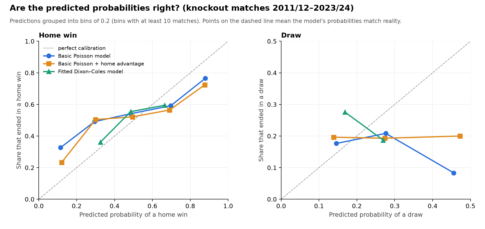

# Does the Poisson model work?

Generated by `model_check.py`. 371 knockout matches from 13 seasons (2011-12 to 2023-24), each predicted using only that season's earlier results. Scored on the 90-minute result: 179 home wins, 72 draws, 120 away wins. Data: [openfootball/champions-league](https://github.com/openfootball/champions-league) (CC0). The 2010/11 season is not in that dataset.

## Scores

Lower is better for RPS, log loss and Brier score. **RPS** (ranked probability score) is the standard measure for football forecasts: it rewards putting probability near the right result (a draw is 'closer' to a home win than an away win is).

| Model | RPS | Log loss | Brier | Favourite correct | Avg P(actual score) |
|---|---|---|---|---|---|
| Guess 1/3 each | 0.2454 | 1.099 | 0.667 | – | – |
| Home/draw/away rates so far | 0.2329 | 1.041 | 0.627 | 48.0% | – |
| Basic Poisson model | 0.2467 | 1.106 | 0.659 | 46.6% | 6.6% |
| Basic Poisson + home advantage | 0.2350 | 1.071 | 0.634 | 48.8% | 6.8% |
| Fitted Dixon–Coles model | 0.2211 | 1.015 | 0.606 | 53.4% | 6.3% |

### Differences in RPS (with 95% bootstrap interval)

Negative = the first model is better. If the interval includes 0, the difference could be chance.

- Basic Poisson model vs home/draw/away rates so far: +0.0138 (-0.0062 to +0.0350)
- Basic Poisson + home advantage vs home/draw/away rates so far: +0.0022 (-0.0158 to +0.0213)
- Fitted Dixon–Coles model vs home/draw/away rates so far: -0.0118 (-0.0208 to -0.0017)
- Adding home advantage to the basic Poisson model: -0.0116 (-0.0180 to -0.0053)
- Dixon–Coles vs basic Poisson + home advantage: -0.0139 (-0.0243 to -0.0038)

## Draws

- Basic Poisson model: predicts 24.0% draws on average; actual 19.4%.
- Basic Poisson + home advantage: predicts 24.0% draws on average; actual 19.4%.
- Fitted Dixon–Coles model: predicts 26.2% draws on average; actual 19.4%.

## Calibration

## The 2014/15 final, predicted from that season's earlier results

Juventus (ITA) v FC Barcelona (ESP): actual 1-3 (Barcelona won 3-1).

| Model | P(Juventus win) | P(draw) | P(Barcelona win) | P(1-3) |
|---|---|---|---|---|
| Guess 1/3 each | 33.3% | 33.3% | 33.3% | – |
| Home/draw/away rates so far | 38.7% | 22.6% | 38.7% | – |
| Basic Poisson model | 28.4% | 33.5% | 38.1% | 2.0% |
| Basic Poisson + home advantage | 28.4% | 33.5% | 38.1% | 2.0% |
| Fitted Dixon–Coles model | 26.7% | 32.1% | 41.2% | 2.8% |

