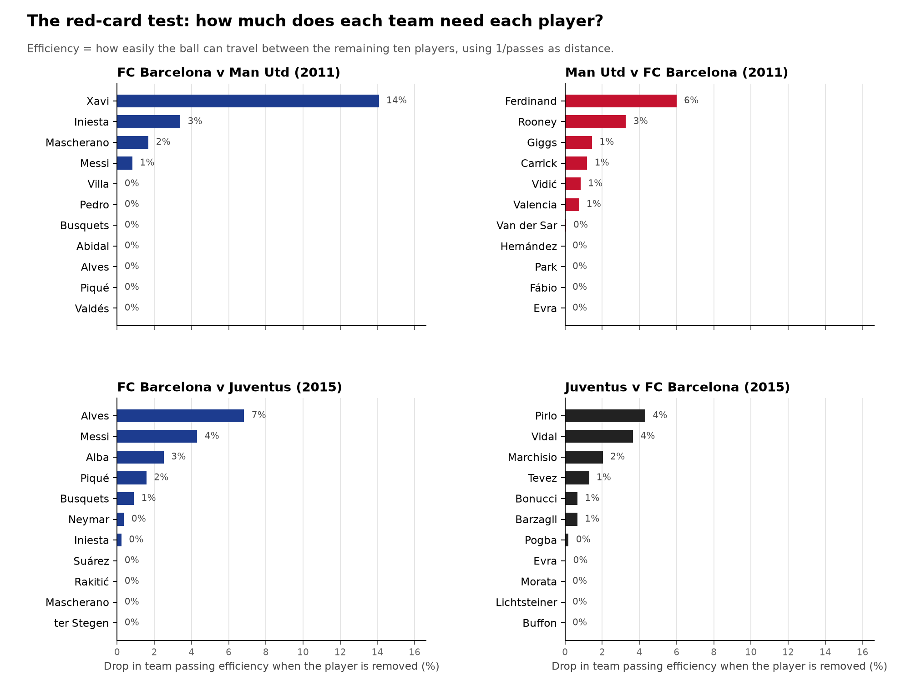

# Extended network analysis

Generated by `network_extra.py`. All measures use 1/passes as distance and passes as strength.

## 1. Team-level measures

| Measure | Barça 2011 | Man Utd 2011 | Barça 2015 | Juventus 2015 |
|---|---|---|---|---|
| Passes between starters | 707 | 262 | 512 | 276 |
| Density (share of the 110 possible links used) | 0.85 | 0.75 | 0.82 | 0.78 |
| Reciprocity (share of passes returned) | 0.79 | 0.69 | 0.72 | 0.59 |
| Passing entropy (1 = passes spread evenly over all links) | 0.882 | 0.894 | 0.887 | 0.900 |
| Betweenness centralisation (1 = everything goes through one player) | 0.528 | 0.181 | 0.192 | 0.192 |
| Share of betweenness held by the top 3 | 91% | 66% | 67% | 62% |
| PageRank inequality (Gini) | 0.284 | 0.174 | 0.200 | 0.157 |
| Involvement inequality (Gini of passes made + received) | 0.311 | 0.175 | 0.211 | 0.162 |
| Mean weighted clustering | 0.163 | 0.224 | 0.152 | 0.185 |
| Relative efficiency (volume-adjusted) | 1.35 | 1.39 | 1.37 | 1.33 |
| Modularity of passing units | 0.056 | 0.156 | 0.152 | 0.093 |

## 2. The red-card test

Each player is removed in turn. **Efficiency drop** compares how easily the ball moves between the other ten players with and without the removed player available to pass through, so it measures how much the others rely on that player as a link. **Involvement** is the share of the team's passes the player made or received.

### Barça 2011

| Player | Efficiency drop | Involvement |
|---|---|---|
| Xavi | 14% | 39% |
| Iniesta | 3% | 32% |
| Mascherano | 2% | 14% |
| Messi | 1% | 28% |
| Valdés | 0% | 5% |
| Piqué | 0% | 11% |
| Alves | 0% | 18% |
| Abidal | 0% | 14% |
| Busquets | 0% | 21% |
| Pedro | 0% | 10% |
| Villa | 0% | 8% |

Most damaging pairs: Xavi + Iniesta (23%), Xavi + Messi (19%), Xavi + Busquets (17%).

Most damaging trios: Xavi + Busquets + Iniesta (31%), Alves + Xavi + Iniesta (27%), Abidal + Xavi + Iniesta (26%).

The essay's trio (Xavi + Iniesta + Messi): 23% drop, ranked 9 of 165 possible trios.

### Man Utd 2011

| Player | Efficiency drop | Involvement |
|---|---|---|
| Ferdinand | 6% | 25% |
| Rooney | 3% | 29% |
| Giggs | 1% | 24% |
| Carrick | 1% | 20% |
| Vidić | 1% | 18% |
| Valencia | 1% | 15% |
| Van der Sar | 0% | 14% |
| Evra | 0% | 16% |
| Fábio | 0% | 11% |
| Park | 0% | 19% |
| Hernández | 0% | 10% |

Most damaging pairs: Ferdinand + Rooney (16%), Ferdinand + Giggs (10%), Carrick + Rooney (8%).

Most damaging trios: Ferdinand + Giggs + Rooney (28%), Ferdinand + Fábio + Rooney (21%), Ferdinand + Carrick + Rooney (20%).

### Barça 2015

| Player | Efficiency drop | Involvement |
|---|---|---|
| Alves | 7% | 29% |
| Messi | 4% | 26% |
| Alba | 3% | 24% |
| Piqué | 2% | 12% |
| Busquets | 1% | 23% |
| Neymar | 0% | 17% |
| Iniesta | 0% | 19% |
| ter Stegen | 0% | 6% |
| Mascherano | 0% | 15% |
| Rakitić | 0% | 18% |
| Suárez | 0% | 11% |

Most damaging pairs: Alba + Alves (15%), Alves + Messi (11%), Alba + Messi (10%).

Most damaging trios: Alba + Alves + Messi (25%), Alba + Alves + Busquets (23%), Alba + Busquets + Messi (18%).

### Juventus 2015

| Player | Efficiency drop | Involvement |
|---|---|---|
| Pirlo | 4% | 29% |
| Vidal | 4% | 23% |
| Marchisio | 2% | 20% |
| Tevez | 1% | 19% |
| Bonucci | 1% | 18% |
| Barzagli | 1% | 19% |
| Pogba | 0% | 21% |
| Evra | 0% | 16% |
| Buffon | 0% | 9% |
| Lichtsteiner | 0% | 15% |
| Morata | 0% | 11% |

Most damaging pairs: Pirlo + Vidal (10%), Bonucci + Pirlo (8%), Marchisio + Vidal (7%).

Most damaging trios: Bonucci + Pirlo + Vidal (18%), Marchisio + Pirlo + Vidal (15%), Pogba + Pirlo + Vidal (13%).

## 3. Passing units

Groups of players who passed mostly among themselves (Louvain community detection, passes in both directions added together).

- **Barça 2011** (modularity 0.056): {Alves, Busquets, Iniesta, Messi, Villa, Xavi} · {Mascherano, Piqué, Valdés} · {Abidal, Pedro}
- **Man Utd 2011** (modularity 0.156): {Carrick, Evra, Giggs, Hernández, Park, Rooney} · {Ferdinand, Fábio, Valencia, Van der Sar, Vidić}
- **Barça 2015** (modularity 0.152): {Alves, Busquets, Messi, Rakitić, Suárez} · {Alba, Iniesta, Mascherano, Neymar} · {Piqué, ter Stegen}
- **Juventus 2015** (modularity 0.093): {Barzagli, Bonucci, Buffon, Pirlo} · {Lichtsteiner, Marchisio, Morata, Vidal} · {Evra, Pogba, Tevez}

## 4. Compared with random networks

For each team, 1000 random networks were generated in which every player makes and receives exactly as many passes as in the real match, but who they pass to is shuffled. If the real value sits far outside the random ones, the pattern comes from *who passed to whom*, not just from how busy each player was. z = distance from the random average in standard deviations; p = two-sided share of random networks at least as extreme (p < 0.05 means very unlikely by chance).

| Measure | Barça 2011 | Man Utd 2011 | Barça 2015 | Juventus 2015 |
|---|---|---|---|---|
| Reciprocity | 0.79 vs 0.80 (z = -0.5, p = 0.684) | 0.69 vs 0.67 (z = +0.8, p = 0.510) | 0.72 vs 0.75 (z = -1.3, p = 0.202) | 0.59 vs 0.66 (z = -1.9, p = 0.084) |
| Passing entropy | 0.882 vs 0.910 (z = -13.8, p < 0.001) | 0.894 vs 0.934 (z = -7.2, p < 0.001) | 0.887 vs 0.944 (z = -19.5, p < 0.001) | 0.900 vs 0.935 (z = -6.4, p < 0.001) |
| Betweenness centralisation | 0.528 vs 0.560 (z = -0.4, p = 0.630) | 0.181 vs 0.217 (z = -0.7, p = 0.486) | 0.192 vs 0.248 (z = -0.9, p = 0.344) | 0.192 vs 0.264 (z = -1.3, p = 0.180) |
| Share of betweenness held by the top 3 | 91% vs 99% (z = -2.7, p = 0.096) | 66% vs 79% (z = -1.8, p = 0.086) | 67% vs 86% (z = -2.8, p = 0.010) | 62% vs 77% (z = -2.2, p = 0.030) |
| Mean weighted clustering | 0.163 vs 0.170 (z = -0.4, p = 0.666) | 0.224 vs 0.261 (z = -1.0, p = 0.382) | 0.152 vs 0.275 (z = -4.0, p < 0.001) | 0.185 vs 0.277 (z = -2.6, p = 0.002) |
| Relative efficiency | 1.35 vs 1.24 (z = +4.5, p < 0.001) | 1.39 vs 1.23 (z = +5.9, p < 0.001) | 1.37 vs 1.15 (z = +11.3, p < 0.001) | 1.33 vs 1.21 (z = +4.3, p < 0.001) |
| Modularity of passing units | 0.056 vs 0.002 (z = +15.5, p < 0.001) | 0.156 vs 0.031 (z = +9.2, p < 0.001) | 0.152 vs 0.007 (z = +19.3, p < 0.001) | 0.093 vs 0.030 (z = +4.6, p = 0.002) |

## 5. How stable are the player rankings?

Each pass count was resampled 1000 times (Poisson noise around the observed count) and the calculations repeated. The table shows how often each player came out on top; only players who topped at least 5% of resamples are listed.

| Team | Top betweenness | Top PageRank | Top in red-card test |
|---|---|---|---|
| Barça 2011 | Xavi 99% | Xavi 87%, Iniesta 11% | Xavi 100% |
| Man Utd 2011 | Rooney 50%, Ferdinand 33%, Giggs 12% | Rooney 79%, Giggs 17% | Ferdinand 49%, Rooney 37%, Giggs 9% |
| Barça 2015 | Alves 65%, Messi 22%, Busquets 6%, Alba 6% | Messi 68%, Alves 29% | Alves 76%, Messi 17%, Alba 5% |
| Juventus 2015 | Pirlo 64%, Vidal 13%, Marchisio 12% | Pirlo 51%, Pogba 27%, Vidal 9%, Tevez 7% | Pirlo 59%, Vidal 25%, Marchisio 7% |

