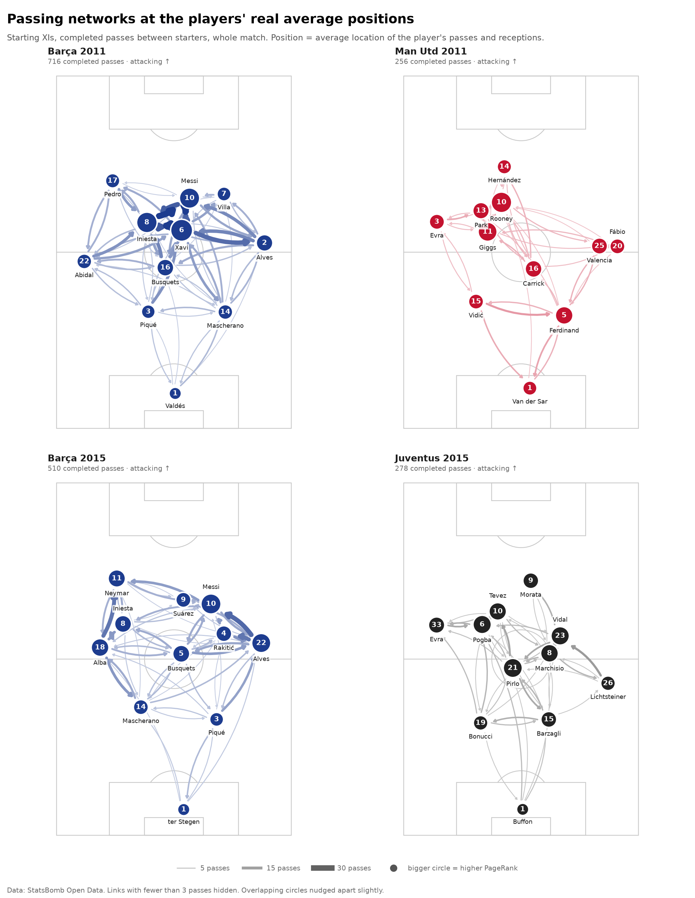
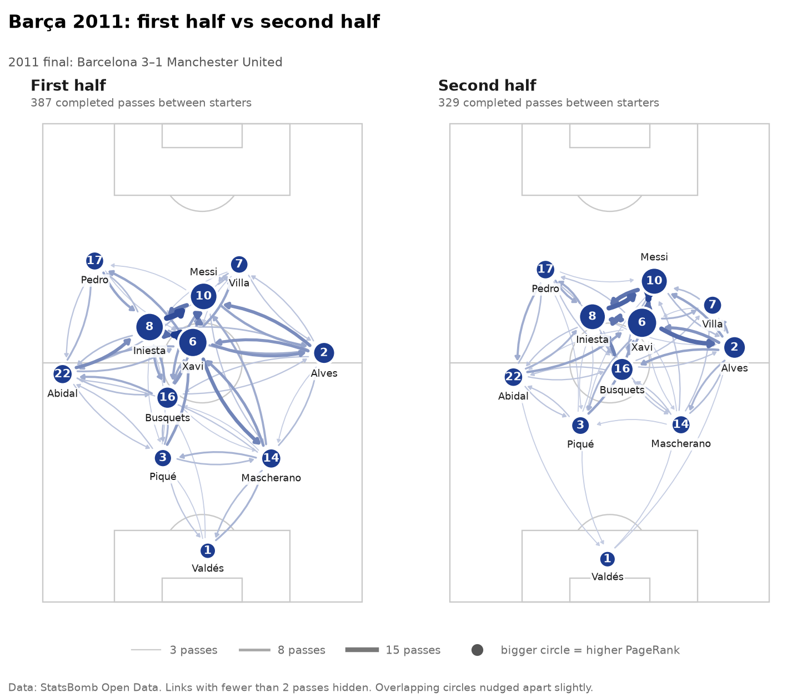
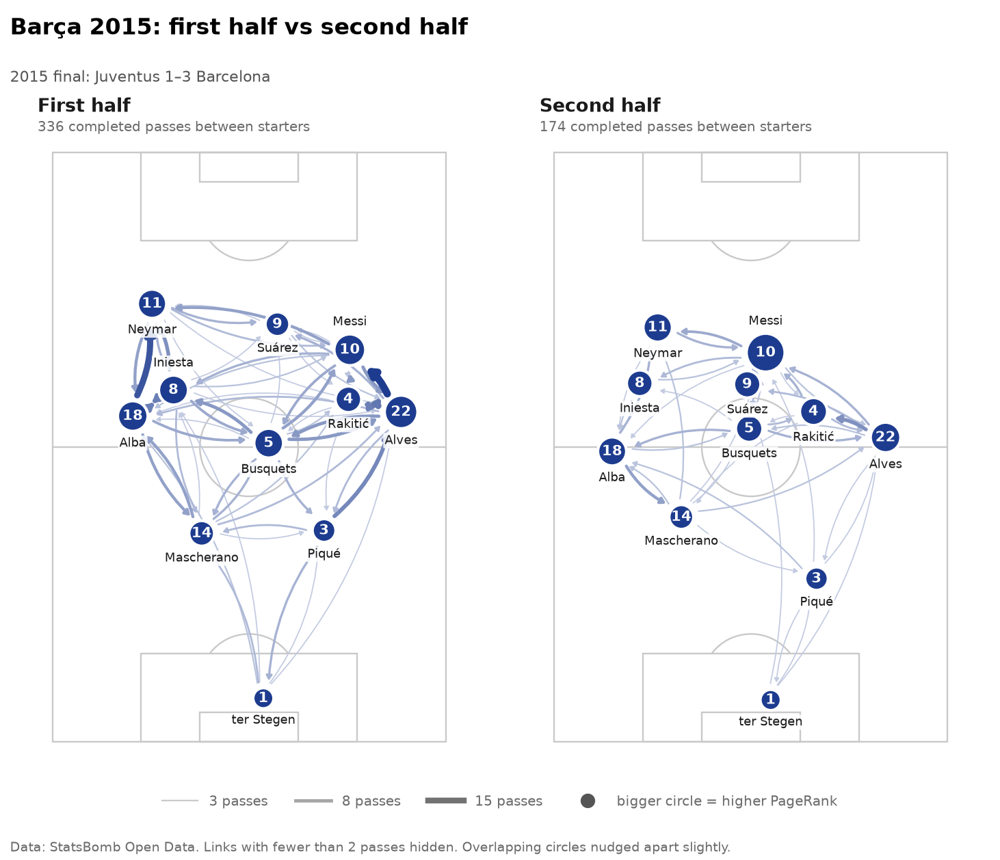
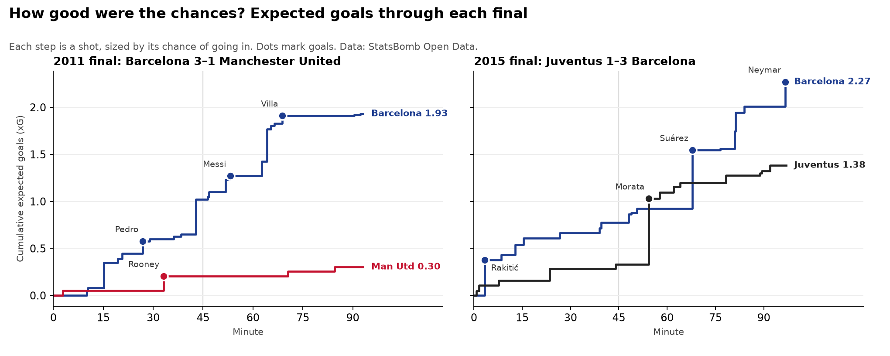

# The finals with StatsBomb event data

Generated by `statsbomb_analysis.py`. Data: [StatsBomb Open Data](https://github.com/statsbomb/open-data) (credit StatsBomb and use their logo if you publish this). Passing matrices count completed passes between the eleven starters over the whole match, as in the essay.

## 1. Does StatsBomb agree with the essay's Opta tables?

| Team | Formation (StatsBomb) | Opta passes | StatsBomb passes | Correlation of the 110 links | Biggest differences (Opta → StatsBomb) |
|---|---|---|---|---|---|
| Barça 2011 | 4-1-2-2-1 | 707 | 716 | 1.00 | Xavi → Mascherano: 15 → 13; Xavi → Messi: 23 → 25; Pedro → Busquets: 2 → 4 |
| Man Utd 2011 | 4-2-2-2 | 262 | 256 | 0.98 | Evra → Rooney: 6 → 4; Van der Sar → Giggs: 1 → 2; Van der Sar → Rooney: 4 → 3 |
| Barça 2015 | 4-1-2-2-1 | 512 | 510 | 0.99 | Busquets → Alves: 16 → 13; Rakitić → Busquets: 7 → 4; ter Stegen → Alba: 5 → 3 |
| Juventus 2015 | 4-1-2-1-2 | 276 | 278 | 0.92 | Marchisio → Bonucci: 6 → 0; Tevez → Morata: 5 → 2; Buffon → Pogba: 3 → 5 |

## 2. Real average positions

Average position of each player (metres from own goal line, along the pitch / from the left touchline):

- **Barça 2011** (most advanced first): Pedro 74/16, Villa 70/49, Messi 69/39, Iniesta 61/26, Xavi 59/36, Alves 55/60, Abidal 50/8, Busquets 48/32, Piqué 35/27, Mascherano 35/49, Valdés 10/34
- **Man Utd 2011** (most advanced first): Hernández 78/29, Rooney 67/28, Park 65/22, Evra 62/10, Giggs 59/24, Valencia 54/58, Fábio 54/60, Carrick 48/38, Vidić 38/21, Ferdinand 34/46, Van der Sar 12/37
- **Barça 2015** (most advanced first): Neymar 77/17, Suárez 70/37, Messi 69/45, Iniesta 63/19, Rakitić 60/48, Alves 57/59, Alba 56/13, Busquets 54/36, Mascherano 38/24, Piqué 35/46, ter Stegen 8/37
- **Juventus 2015** (most advanced first): Morata 76/37, Tevez 67/27, Pogba 63/23, Evra 63/10, Vidal 59/45, Marchisio 54/42, Pirlo 50/32, Lichtsteiner 45/59, Barzagli 35/42, Bonucci 33/22, Buffon 8/34

## 3. Network results: Opta tables vs StatsBomb

Same corrected measures as `RESULTS.md` (1/passes distance; weighted PageRank).

| Team | Data | Top betweenness | Top PageRank | Most needed (red-card test) | Betweenness centralisation | Modularity |
|---|---|---|---|---|---|---|
| Barça 2011 | Opta | Xavi, Mascherano, Iniesta | Xavi, Iniesta, Messi | Xavi 14%, Iniesta 3% | 0.528 | 0.056 |
| Barça 2011 | StatsBomb | Xavi, Mascherano, Iniesta | Xavi, Iniesta, Messi | Xavi 14%, Iniesta 3% | 0.539 | 0.062 |
| Man Utd 2011 | Opta | Ferdinand, Rooney, Carrick | Rooney, Giggs, Ferdinand | Ferdinand 6%, Rooney 3% | 0.181 | 0.156 |
| Man Utd 2011 | StatsBomb | Ferdinand, Rooney, Giggs | Rooney, Giggs, Ferdinand | Ferdinand 7%, Rooney 3% | 0.219 | 0.162 |
| Barça 2015 | Opta | Messi, Alves, Busquets | Messi, Alves, Alba | Alves 7%, Messi 4% | 0.192 | 0.152 |
| Barça 2015 | StatsBomb | Alves, Messi, Busquets | Messi, Alves, Alba | Alves 7%, Messi 5% | 0.301 | 0.148 |
| Juventus 2015 | Opta | Pirlo, Marchisio, Vidal | Pirlo, Pogba, Vidal | Pirlo 4%, Vidal 4% | 0.192 | 0.093 |
| Juventus 2015 | StatsBomb | Pirlo, Marchisio, Barzagli | Pirlo, Vidal, Pogba | Pirlo 5%, Vidal 4% | 0.237 | 0.101 |

## 4. First half vs second half

| Team | Half | Completed passes | Share of team's passes in final third | Top PageRank | Betweenness centralisation |
|---|---|---|---|---|---|
| Barça 2011 | 1 | 387 | 24% | Xavi, Iniesta | 0.559 |
| Barça 2011 | 2 | 329 | 25% | Xavi, Messi | 0.349 |
| Man Utd 2011 | 1 | 139 | 29% | Giggs, Rooney | 0.199 |
| Man Utd 2011 | 2 | 117 | 17% | Rooney, Ferdinand | 0.266 |
| Barça 2015 | 1 | 336 | 24% | Alves, Messi | 0.273 |
| Barça 2015 | 2 | 174 | 28% | Messi, Alves | 0.284 |
| Juventus 2015 | 1 | 138 | 14% | Pirlo, Vidal | 0.298 |
| Juventus 2015 | 2 | 140 | 25% | Tevez, Pogba | 0.102 |

## 5. Expected goals

Each shot's xG is StatsBomb's estimate of the chance it goes in. Shots in the same possession (rebounds) are combined so one move cannot count as several independent chances. The simulation replays every chance 100,000 times to ask: *given the chances each team actually created, how often would this match end in each result?*

| Final | Team | Shots | xG | Goals | P(win) from chances | P(draw) | P(exact score) | Pre-match model P(win) |
|---|---|---|---|---|---|---|---|---|
| 2011 | Barcelona | 22 | 1.93 | 3 | 80% | 16% | 4.8% | 24% |
| 2011 | Manchester United | 4 | 0.30 | 1 | 4% | 16% | 4.8% | 35% |
| 2015 | Barcelona | 17 | 2.27 | 3 | 59% | 23% | 10.8% | 38% |
| 2015 | Juventus | 15 | 1.38 | 1 | 18% | 23% | 10.8% | 28% |

## 6. Does network importance lead to chances?

**xGChain** = total xG of the shot-ending possessions a player was involved in. **xGBuildup** = the same but leaving out possessions in which the player took the shot or made the final pass, so it measures the build-up. Spearman ρ compares each team's ranking of players by PageRank (StatsBomb network) with their ranking by xGBuildup (n = 11, so only large values mean much).

- **Barça 2011**: highest xGChain Messi 1.80, Busquets 1.65, Xavi 1.55, Iniesta 1.46; highest xGBuildup Busquets 1.57, Abidal 1.06, Xavi 1.04. PageRank vs xGBuildup: ρ = 0.31 (p = 0.36).
- **Man Utd 2011**: highest xGChain Rooney 0.30, Giggs 0.26, Carrick 0.26, Fábio 0.15; highest xGBuildup Carrick 0.21, Giggs 0.20, Fábio 0.15. PageRank vs xGBuildup: ρ = 0.35 (p = 0.29).
- **Barça 2015**: highest xGChain Messi 2.02, Alves 1.66, Rakitić 1.59, Suárez 1.42; highest xGBuildup Alves 1.43, Messi 1.33, Mascherano 1.08. PageRank vs xGBuildup: ρ = 0.65 (p = 0.03).
- **Juventus 2015**: highest xGChain Marchisio 0.95, Morata 0.94, Tevez 0.87, Barzagli 0.79; highest xGBuildup Marchisio 0.75, Lichtsteiner 0.20, Vidal 0.18. PageRank vs xGBuildup: ρ = 0.06 (p = 0.85).

